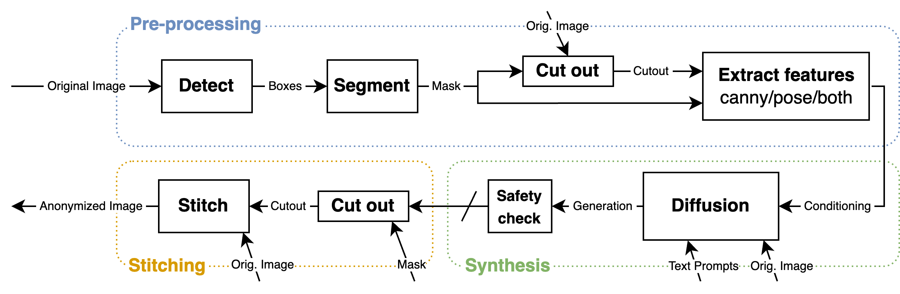

# RAD: Realistic Anonymization of Images Using Stable Diffusion
RAD is a full-body realistic anonymization pipeline based on Stable Diffusion. Below are a few anonymization examples displayed as GIFs, and a visualization of RAD's architecture. We refer to the publication for more examples and details about the pipeline.




## Installation (Linux)
1. Clone repository:
```bash
git clone git@github.com:viktorronnback/RAD.git realistic-anonymization
```

2. Go to the root directory of the repository:
```bash
cd realistic-anonymization
```

3. Create conda environment from yml file:
```bash
conda env create -f environment.yml
```

4. Activate conda environment:
```bash
conda activate rad
```

5. Install Facebook's segmentation model SAM by downloading a checkpoint:
```bash
wget https://dl.fbaipublicfiles.com/segment_anything/sam_vit_h_4b8939.pth -P anonymizer/models/
```

## Run anonymization
Instructions for running a demo anonymization below.

1. Go to anonymizer folder:
```bash
cd anonymizer
```

2. Run anonymization using demo configuration file:
```bash
python main.py demo.yaml
```

3. The anonymized images can be found in: `output/demo/final`.

This will automatically download models on the initial run (these can be large >10 GB).

Demo images in anonymizer/input/demo/ are stock-photos from pexels.com. 

## Configurations

The anonymizer/template.config.yaml file provides a template for the supported configurations with corresponding default values. 

## Publication

The tool was originally created as part of a master thesis in Computer Science at Linköping University.

[Link to thesis (added after publication)](no-link-yet) - RAD: Realistic Anonymization of Images using Stable Diffusion
