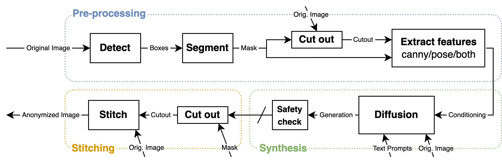

# RAD - Realistic Anonymization using Diffusion
RAD is a full-body realistic anonymization pipeline based on Stable Diffusion.




## Installation

1. Install PyTorch, [instructions](https://pytorch.org/get-started/locally/)

2. Clone repository:
```bash
git clone git@github.com:viktorronnback/realistic-anonymization-test.git realistic-anonymization
```

3. Go to the root directory of the repository:
```bash
cd realistic-anonymization
```

4. Install pip dependencies:
```bash
pip install -r requirements.txt
```

## Run anonymization

Demo anonymization:
```bash
python main.py config.yaml
```

Will automatically download models on the initial run (these can be large >10 GB)

Demo images in anonymizer/input/demo/ are stock-photos from pexels.com.  

## Publication

The tool was created as part of a master thesis in Computer Science at Linköping University.

<!-- [Link to thesis](no-link-yet) - RAD: Realistic Anonymization of Images using Stable Diffusion -->
